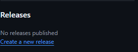
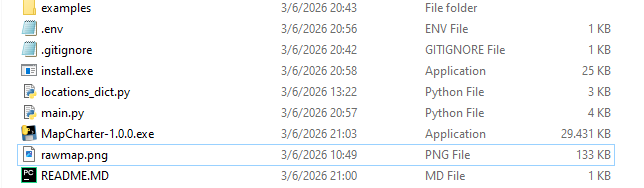
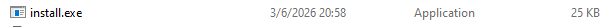
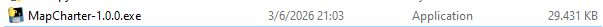
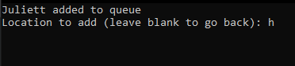
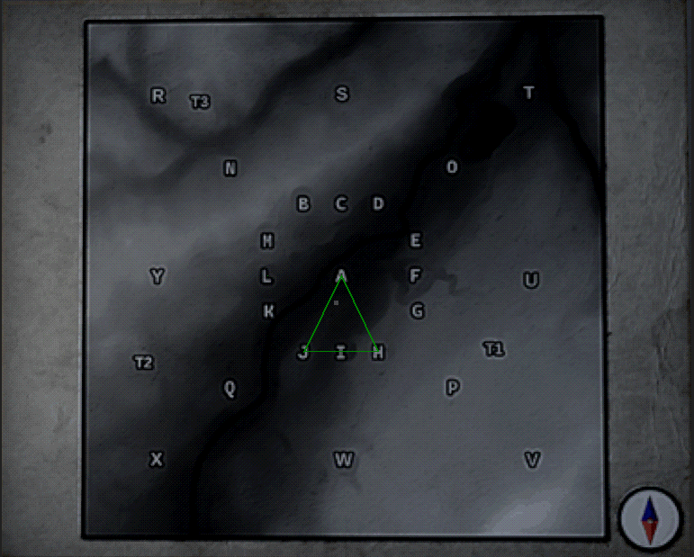

# How to Set Up:

---

- ##  Download the .rar file from releases

- ## Extract all files in a directory

- # Run the installer

*This will create a .env file with the location of the map image critical to the functioning of the program, don't skip this step.*
- # All done!

---

# How to Use:

---

- ## Run the executable

- ## Add destinations (their initials)
*Transformers are tr1, tr2, and tr3*

- ## Raster the map
*This clears your current destination queue*

## If you're cloning the repository, you might need to run *install.exe* to create the .env file, too.